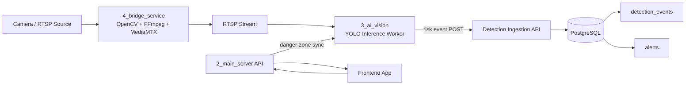

# 3_ai_vision 백엔드 역할 정립 문서

작성일: 2026-04-08

## Requirements Summary

- 담당 범위는 `3_ai_vision`이다.
- 이 문서에서 사용하는 저장 구조는 `AI 서버 -> 메인 서버 -> PostgreSQL`이다.
- `3_ai_vision`의 핵심 책임은 `YOLO 탐지`, `위험 구역 침범 판정`, `위험 이벤트 생성`, `메인 서버로 이벤트 전달`이다.
- PostgreSQL 적재, 도메인 모델 관리, 알림 생성은 메인 서버 책임으로 둔다.

근거:
- AI 메인 루프는 현재 `카메라 입력 -> YOLO 탐지 -> 구역 침범 체크 -> 이벤트 전송` 구조다. [../3_ai_vision/main_vision.py](../3_ai_vision/main_vision.py)
- 탐지 결과는 이미 `class_name`, `confidence`, `bbox`, `center`를 포함하도록 정리되어 있다. [../3_ai_vision/models/detector.py](../3_ai_vision/models/detector.py)
- 위험 구역 판정은 정규화 좌표 기반으로 완성되어 있다. [../3_ai_vision/core/zone_checker.py](../3_ai_vision/core/zone_checker.py)
- PostgreSQL 스키마와 저장 대상 모델은 메인 서버에 이미 존재한다. [../2_main_server/app/db/models.py](../2_main_server/app/db/models.py)
- 이벤트 전달 방향 역시 AI -> 메인 서버 저장 흐름으로 정리할 수 있다. [event_schemas.json](./event_schemas.json)

## 시스템 구조

- AI 서버는 위험 정보를 직접 PostgreSQL에 저장하지 않는다.
- AI 서버는 위험 이벤트를 표준 payload로 생성한다.
- 메인 서버가 그 이벤트를 받아 PostgreSQL의 `detection_events`, `alerts`에 저장한다.

## 역할 정의

### 3_ai_vision이 맡는 일

- RTSP 또는 카메라 입력에서 프레임을 읽는다.
- YOLO로 `baby`를 탐지하고 confidence threshold를 관리한다.
- 메인 서버에서 카메라별 위험 구역을 조회하거나 동기화받는다.
- 탐지된 객체가 위험 구역을 침범했는지 판정한다.
- cooldown을 적용해 중복 이벤트를 줄인다.
- 메인 서버가 바로 저장할 수 있는 이벤트 payload를 만든다.
- 이벤트를 메인 서버 ingestion 경로로 전송한다.

### 2_main_server가 맡는 일

- 위험 이벤트를 수신하는 ingestion API를 제공한다.
- 수신한 이벤트를 `detection_events`에 저장한다. [../2_main_server/app/db/models.py](../2_main_server/app/db/models.py)
- 필요 시 같은 흐름에서 `alerts`를 생성한다. [../2_main_server/app/db/models.py](../2_main_server/app/db/models.py)
- 사용자, 카메라, 위험 구역, 알림 조회 API를 관리한다.

### 4_bridge_service가 맡는 일

- 카메라 영상을 MediaMTX로 올린다.
- 앱과 AI가 볼 수 있는 RTSP 스트림을 유지한다.
- 기본 역할은 영상 중계다. 이벤트 저장 책임은 갖지 않는다. [../4_bridge_service/main.py](../4_bridge_service/main.py)

## 권장 아키텍처

## 아키텍처 해석

- 현재 프로젝트에서 PostgreSQL 스키마와 도메인 모델은 메인 서버에 이미 있다. [../2_main_server/app/db/models.py](../2_main_server/app/db/models.py)
- `3_ai_vision`은 추론과 위험 판정이 핵심이고, DB 트랜잭션과 알림 생성까지 책임지기 시작하면 역할이 과하게 커진다.
- 저장 책임을 메인 서버에 두면 스키마 변경, 알림 정책, 로그 추적, API 조회 흐름이 한곳에서 관리된다.
- 이후 FCM, 알림 정책, 관리자 화면 같은 기능이 붙어도 메인 서버에서 일관되게 확장할 수 있다.

## 현재 구조 기준에서 바로 보이는 갭

- AI는 현재 `/zones`를 조회하지만 실제 서버 라우터는 `/danger-zones/{camera_id}` 구조다. [../3_ai_vision/main_vision.py](../3_ai_vision/main_vision.py), [../2_main_server/app/routers/danger_zones.py](../2_main_server/app/routers/danger_zones.py)
- AI 이벤트 payload에는 `camera_id`가 없는데 DB의 `detection_events.camera_id`는 필수다. [event_schemas.json](./event_schemas.json), [../2_main_server/app/db/models.py](../2_main_server/app/db/models.py)
- AI는 `http://localhost:9000/event`로 전송하지만, 현재 브릿지에는 event receiver 구현이 보이지 않는다. [../3_ai_vision/main_vision.py](../3_ai_vision/main_vision.py)

## 이벤트 계약

`3_ai_vision`이 메인 서버로 전달해야 할 최소 필드는 아래와 같다.

- `camera_id`
- `event_type`
- `zone_id`
- `zone_name`
- `confidence`
- `bbox`
- `frame_id`
- `detected_at`
- `snapshot_path`

이 필드는 메인 서버가 `detection_events`와 `alerts`를 생성하는 데 필요한 최소 정보다. [../2_main_server/app/db/models.py](../2_main_server/app/db/models.py)

## Acceptance Criteria

- `3_ai_vision`의 책임이 `탐지와 이벤트 생산`으로 고정된다.
- 저장 경로가 `AI -> 메인 서버 -> PostgreSQL`로 명시된다.
- 각 컴포넌트의 책임이 겹치지 않게 정의된다.
- 현재 코드 기준의 주요 갭이 3개 이상 식별된다.
- 다음 구현 순서가 파일 기준으로 정리된다.

## Detailed Work Plan

### Phase 1. 이벤트 계약 먼저 고정

목표:
- `3_ai_vision`이 어떤 형식의 이벤트를 메인 서버로 보내는지 팀 기준을 고정한다.

세부 작업:
- 위험 이벤트 request body 초안을 문서에 명시한다.
- 필수 필드와 선택 필드를 구분한다.
- `camera_id`, `event_type`, `zone_id`, `zone_name`, `confidence`, `bbox`, `frame_id`, `detected_at`를 필수값으로 확정한다.
- `snapshot_path`는 초기에는 선택값으로 두고, 캡처 저장 전략이 정해지면 필수 여부를 다시 판단한다.
- timestamp 형식을 ISO 8601 UTC 문자열로 통일한다.
- bbox 형식을 `[x1, y1, x2, y2]`로 통일한다.

수정 대상:
- [event_schemas.json](./event_schemas.json)
- [../3_ai_vision/main_vision.py](../3_ai_vision/main_vision.py)

산출물:
- 팀이 공유할 위험 이벤트 payload 규격
- `3_ai_vision` 코드에 반영할 필드 목록

완료 기준:
- 메인 서버 쪽에서 이 payload만 받아도 `detection_events`를 저장할 수 있어야 한다.
- `camera_id` 누락 문제를 더 이상 남기지 않아야 한다.

테스트 작업:
- 이벤트 payload 예시가 문서 규격과 일치하는지 확인하는 fixture 또는 샘플 테스트를 추가한다.
- 필수 필드 누락 시 validation 실패가 나도록 메인 서버 request schema 테스트를 작성한다.

### Phase 2. zone-sync 경로 정리

목표:
- AI가 실제 서버 구조와 맞는 방식으로 위험 구역을 받아올 수 있게 만든다.

세부 작업:
- 현재 AI가 호출하는 `/zones`와 실제 서버 라우터 구조의 차이를 해소한다.
- 카메라 단위 zone 조회 API를 그대로 사용할지, AI 전용 zone-sync endpoint를 따로 둘지 정한다.
- AI가 zone 데이터를 받았을 때 바로 `ZoneManager.load_zones()`에 넣을 수 있도록 응답 필드를 맞춘다.
- zone response에 최소한 `zone_id`, `name`, `points`가 들어오도록 정리한다.

수정 대상:
- [../3_ai_vision/main_vision.py](../3_ai_vision/main_vision.py)
- [../2_main_server/app/routers/danger_zones.py](../2_main_server/app/routers/danger_zones.py)
- 필요 시 [api_specs.md](./api_specs.md)

산출물:
- AI용 zone-sync API 규격
- zone response 예시 payload

완료 기준:
- AI가 카메라별 위험 구역을 정상 조회할 수 있어야 한다.
- 추가 변환 로직 없이 `ZoneManager.load_zones()`에 넣을 수 있어야 한다.

테스트 작업:
- zone-sync 응답이 `ZoneManager.load_zones()` 입력 형식과 호환되는지 단위 테스트를 작성한다.
- 잘못된 zone 포맷이 들어올 때 실패하는 케이스를 테스트한다.

### Phase 3. 메인 서버 ingestion API 구현

목표:
- AI가 보낸 위험 이벤트를 메인 서버가 받아 PostgreSQL에 저장할 수 있게 만든다.

세부 작업:
- ingestion 전용 request schema를 만든다.
- 위험 이벤트 수신 endpoint를 추가한다.
- 수신한 payload를 `detection_events` 레코드로 변환한다.
- `camera_id`, `event_type`, `confidence`, `bbox`, `snapshot_path`, `detected_at`를 저장한다.
- 필요 시 zone 정보와 사용자 정보를 매핑해 `alerts` 레코드도 함께 생성한다.
- 잘못된 payload에 대해 4xx validation 응답을 주도록 한다.

수정 대상:
- [../2_main_server/app/main.py](../2_main_server/app/main.py)
- [../2_main_server/app/db/models.py](../2_main_server/app/db/models.py)
- 새 라우터 또는 스키마 파일 추가 가능

산출물:
- 위험 이벤트 수신 API
- `detection_events` 저장 로직
- `alerts` 생성 초안

완료 기준:
- 샘플 payload POST 시 `detection_events`에 1건이 들어가야 한다.
- 실패 payload에는 명확한 validation error가 반환되어야 한다.

테스트 작업:
- ingestion endpoint 성공 케이스 integration test를 작성한다.
- 필수 필드 누락, 잘못된 bbox 형식, 존재하지 않는 `camera_id`에 대한 실패 케이스 테스트를 작성한다.
- 저장 후 `detection_events` 레코드가 실제로 생성됐는지 검증하는 DB 테스트를 포함한다.

### Phase 4. AI -> 메인 서버 direct POST 연결

목표:
- AI가 브릿지를 거치지 않고 메인 서버 ingestion endpoint로 직접 이벤트를 전송하게 만든다.

세부 작업:
- `BRIDGE_EVENT_URL` 개념을 메인 서버 ingestion URL로 바꾼다.
- 이벤트 전송 함수를 메인 서버 request 형식에 맞게 수정한다.
- 전송 성공/실패 로그를 남긴다.
- 메인 서버 응답 코드별 처리 기준을 정한다.
- 최소 1회 retry 전략 또는 실패 로그 축적 전략을 넣는다.

수정 대상:
- [../3_ai_vision/main_vision.py](../3_ai_vision/main_vision.py)

산출물:
- direct POST 기반 전송 로직
- 실패 시 재시도 또는 에러 로그 정책

완료 기준:
- 위험 상황 발생 시 AI가 ingestion endpoint로 직접 POST를 보내야 한다.
- 메인 서버가 정상 응답하면 이벤트가 저장되어야 한다.

테스트 작업:
- 이벤트 전송 함수를 mock 서버 기준으로 검증하는 단위 테스트를 작성한다.
- 메인 서버가 5xx를 반환할 때 retry 또는 실패 로그 동작을 검증하는 테스트를 작성한다.

### Phase 5. 알림 생성 규칙 연결

목표:
- 위험 이벤트 저장 이후 사용자 관점에서 조회 가능한 알림 흐름을 완성한다.

세부 작업:
- `camera_id`를 기준으로 소유 사용자를 찾는 규칙을 정한다.
- 어떤 이벤트가 alert 생성 대상인지 정의한다.
- alert message 포맷을 정한다.
- 동일 이벤트에 대한 중복 alert 생성 방지 기준을 정한다.

수정 대상:
- [../2_main_server/app/db/models.py](../2_main_server/app/db/models.py)
- [../2_main_server/app/routers/alerts.py](../2_main_server/app/routers/alerts.py)
- ingestion 관련 신규 로직

산출물:
- alert 생성 정책
- alert 저장 로직

완료 기준:
- 위험 이벤트 저장 후 해당 사용자에게 연결된 `alerts` 레코드가 생성되어야 한다.
- 조회 API에서 방금 생성한 alert가 보여야 한다.

테스트 작업:
- ingestion 이후 `alerts` 생성 여부를 확인하는 integration test를 작성한다.
- 동일 이벤트 중복 입력 시 alert 중복 생성 방지 규칙이 있다면 그 케이스도 테스트한다.

### Phase 6. 운영 안정성 보강

목표:
- 실시간 파이프라인이 일시 장애에도 쉽게 무너지지 않도록 만든다.

세부 작업:
- AI 전송 실패 시 retry 횟수와 간격을 정한다.
- cooldown 정책을 zone 단위로 유지한다.
- snapshot 생성 실패 시 이벤트 자체는 저장되도록 분리한다.
- heartbeat 전송 또는 health log를 추가해 AI 프로세스 상태를 추적할 수 있게 한다.
- 메인 서버 쪽 ingestion error log를 남긴다.

수정 대상:
- [../3_ai_vision/main_vision.py](../3_ai_vision/main_vision.py)
- 메인 서버 ingestion 로직
- 필요 시 [event_schemas.json](./event_schemas.json)

산출물:
- retry 정책
- heartbeat 또는 상태 로그
- 장애 대응 기준

완료 기준:
- 일시적인 서버 연결 실패가 한 번 발생해도 전체 AI 루프가 바로 종료되지 않아야 한다.
- snapshot 실패가 detection event 저장 실패로 이어지지 않아야 한다.

테스트 작업:
- 전송 실패 후 재시도 로직 단위 테스트를 작성한다.
- snapshot 생성 실패 시 이벤트 저장 경로는 유지되는지 테스트한다.
- heartbeat payload가 규격대로 생성되는지 테스트한다.

### Phase 7. 문서와 API 명세 동기화

목표:
- 구현 후 문서와 실제 코드가 다시 어긋나지 않게 맞춘다.

세부 작업:
- 현재 문서의 아키텍처 설명과 실제 코드 흐름을 일치시킨다.
- API 명세서에 ingestion endpoint와 zone-sync endpoint를 추가한다.
- event schema 문서 예시를 실제 request/response와 맞춘다.

수정 대상:
- [api_specs.md](./api_specs.md)
- [event_schemas.json](./event_schemas.json)
- [backend-role-architecture.md](./backend-role-architecture.md)

산출물:
- 최신화된 API 명세
- 최신화된 이벤트 스키마
- 최신화된 역할 문서

완료 기준:
- 새 팀원이 문서만 읽고도 AI 저장 흐름을 이해할 수 있어야 한다.
- 문서의 endpoint 이름과 실제 코드가 일치해야 한다.

테스트 작업:
- 새로 추가한 API/이벤트 테스트 케이스 목록을 문서에 반영한다.
- 구현된 테스트와 문서의 용어가 일치하는지 점검한다.

## Risks and Mitigations

- zone-sync 계약 불일치
  - 위험: AI가 구역을 못 받아 침범 판정이 깨진다.
  - 대응: AI 입력 형식에 맞는 zone-sync 응답을 먼저 고정한다.

- `camera_id` 누락
  - 위험: detection event 저장이 불가능하다.
  - 대응: 카메라 등록 단계에서 `camera_id`를 AI 실행 설정값으로 넘긴다.

- ingestion endpoint 미구현
  - 위험: 실제 저장 경로가 비어 있게 된다.
  - 대응: 메인 서버 ingestion API를 첫 구현 순서로 올린다.

- snapshot 경로 처리 미정
  - 위험: 이벤트는 저장되지만 상세 조회 품질이 떨어진다.
  - 대응: 초기에는 optional 필드로 두고, 이후 캡처 저장 전략을 붙인다.

## Verification Steps

1. AI 샘플 payload가 `camera_id`, `zone_id`, `confidence`, `bbox`, `detected_at`를 포함하는지 확인한다.
2. 메인 서버 ingestion endpoint가 payload를 받아 `detection_events`에 1건 저장하는지 확인한다.
3. 위험 이벤트 저장 후 `alerts` 생성 여부를 확인한다.
4. zone-sync 응답이 `ZoneManager.load_zones()` 입력과 호환되는지 확인한다. [../3_ai_vision/core/zone_checker.py](../3_ai_vision/core/zone_checker.py)
5. AI가 메인 서버로 direct POST 실패 시 재시도 또는 실패 로그를 남기는지 확인한다.

## 실행 우선순위

1. 이벤트 payload 확정
2. zone-sync 계약 확정
3. 메인 서버 ingestion endpoint 구현
4. AI -> 메인 서버 direct POST 연결
5. alert 생성 정책 연결
6. heartbeat, retry, snapshot 보강

## 작업 체크리스트

- [ ] 위험 이벤트 payload 필드 확정
- [ ] payload validation 테스트 작성
- [ ] zone-sync 응답 형식 확정
- [ ] zone-sync 테스트 작성
- [ ] ingestion endpoint 구현
- [ ] `detection_events` 저장 확인
- [ ] ingestion integration test 작성
- [ ] `alerts` 생성 확인
- [ ] alert 생성 테스트 작성
- [ ] AI direct POST 연결
- [ ] direct POST / retry 테스트 작성
- [ ] retry / cooldown 정책 반영
- [ ] snapshot 실패 분리 처리
- [ ] snapshot / heartbeat 테스트 작성
- [ ] API 문서와 코드 동기화

## 결론

이번 프로젝트에서 `3_ai_vision`의 공식 역할은 아래 한 줄로 정리한다.

`3_ai_vision은 YOLO 기반 위험 감지를 수행하고, 카메라별 위험 구역을 기준으로 침범 이벤트를 생성해 메인 서버로 전달하는 위험 이벤트 생산 컴포넌트다.`

그리고 저장 구조는 아래 한 줄로 고정한다.

`위험 정보 저장은 AI가 직접 PostgreSQL에 넣지 않고, 메인 서버가 이벤트를 수신해 PostgreSQL에 저장한다.`
